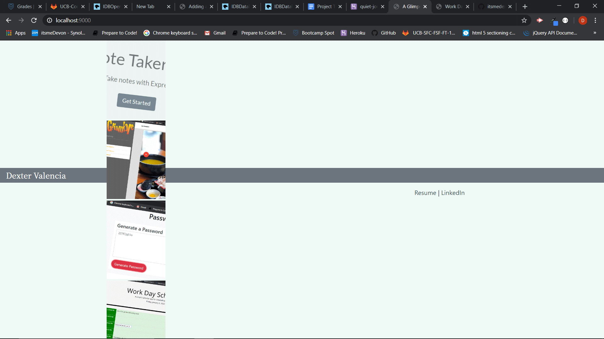

# Updated Portfolio Part 3

Here is an updated Portfolio built with HTML, CSS, Bootstrap, Javascript, Express. I finally added a little Javascript and some color. Something I wanted to do from the beginning, but thought it was going to be hard. Also, used express to handle the backend. First I was thinking of using MVC, but it didn't make any sense. Maybe later on when I have more routes, use models, and doing local API requests. 

### Before and after

### Prerequisites

Any web browser can view live link, (https://quiet-journey-29473.herokuapp.com/). Repository link, (https://github.com/itsmedexter/unit16_unit16_portfolio), .

## Technolgies Used

* [HTML](https://developer.mozilla.org/en-US/docs/Web/HTML)
* [CSS](https://developer.mozilla.org/en-US/docs/Web/CSS)
* [Bootstrap] (https://stackpath.bootstrapcdn.com/bootstrap/4.3.1/css/bootstrap.min.css)
* [Node](https://nodejs.org/en/)
* [Express](https://expressjs.com/)

## Deployed Link

* [See Live Site](https://quiet-journey-29473.herokuapp.com/)

## Authors

Dexter Valencia 

- [Link to Portfolio Site](https://github.com/itsmedexter/unit16_unit16_portfolio)
- [Link to Github](https://github.com/itsmedexter)
- [Link to LinkedIn](https://www.linkedin.com/in/dextervalencia/)

## License

This project is licensed under the MIT License 

## Acknowledgments

* Thanks Kerwin for reminder on mediaquery.  
